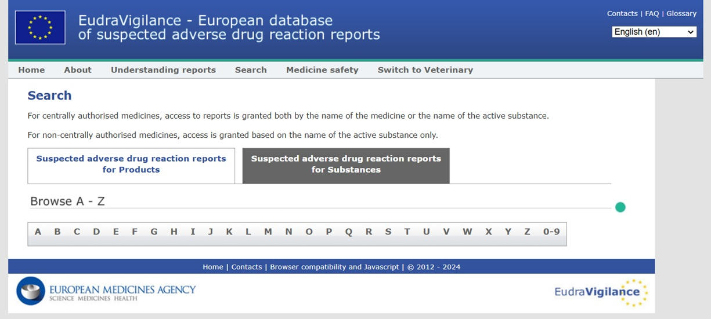
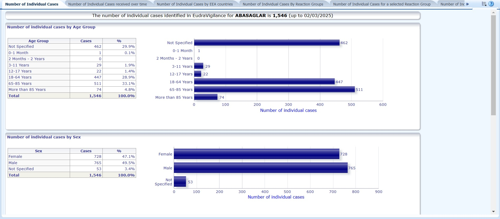
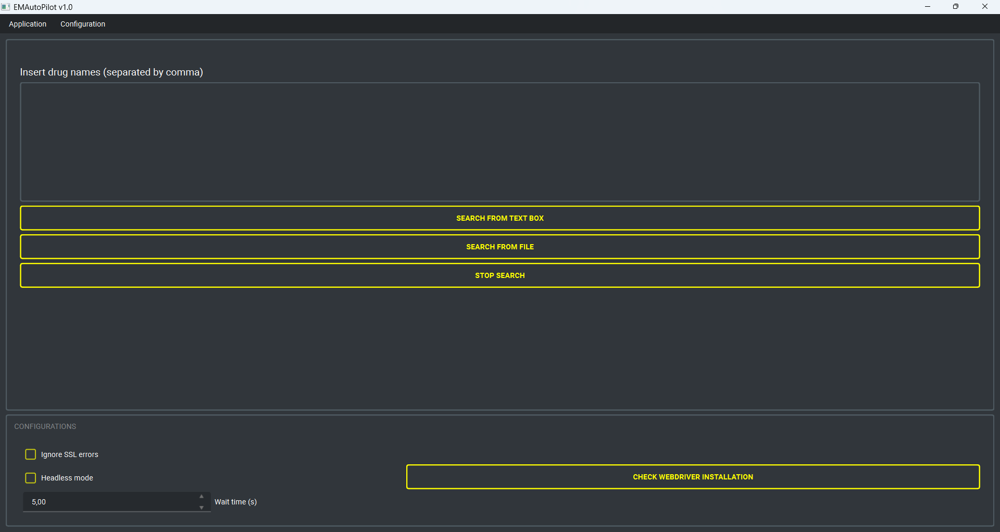

# EMADB AutoPilot

## 1. Introduction
This project aims to develop a framework that autonomously navigates multiple drug-related online resources to retrieve data regarding drugs interactions and EMA drugs adverse reactions reports. Initially designed to browse the EMA database of EudraVigilance (European Database of suspected adverse drug reaction reports), the project has now been expanded to incorporate additional functionalities.

EudraVigilance is a data processing network and management system for reporting and evaluating suspected adverse drug reactions (ADRs) during the development and following the marketing authorization of medicinal products in the European Economic Area (EEA). The system supports the electronic exchange of suspected adverse drug reaction reports known as Individual Case Safety Reports (ICSRs) between the European Medicines Agency (EMA), National Competent Authorities (NCAs), Marketing Authorization Holders (MAHs), and sponsors of clinical trials in the EEA.

The script automates navigation to https://www.adrreports.eu/en/search.html, where it searches for target drugs specified in *resources/drugs_to_search.txt*. Upon locating the target drugs, the script downloads associated data reports in the form of Excel files. The implementation uses ChromeDriver to simulate user interaction with the browser, ensuring smooth and accurate navigation of the EMA database.

**Status:** This project is no longer maintained or updated, and it will not be updated in the future.

Search page at https://www.adrreports.eu/en/search.html#

The suspected adverse drug reaction report for Abasaglar

## 2. Installation
The installation process for Windows is fully automated. Simply run the script `start_on_windows.bat` to begin. During its initial execution, the script installs portable Python, necessary dependencies, minimizing user interaction and ensuring all components are ready for local use.  

## 3. How to use
On Windows, run `start_on_windows.bat` to launch the application. Please note that some antivirus software, such as Avast, may flag or quarantine python.exe when called by the .bat file. If you encounter unusual behavior, consider adding an exception in your antivirus settings.

The main UI allows you to either run a search from file or to use the input text box to insert drug names. Since the script is based on Chromedriver, your need to have Google Chrome browser installed in your system! The correct driver version will be automatically installed, or loaded from the cache if present (default location is home/.wdm).

**Setup and Maintenance:** you can run *setup_and_maintenance.bat* to start the external tools for maintenance with the following options:

- **Update project:** check for updates from Github
- **Remove logs:** remove all logs file from *resources/logs*

### 3.1 Resources
This folder is used to organize the main data for the project, including downloaded files saved in *resources/download* and the app logs located in *resources/logs*. The *resources/drugs_to_search.txt* file contains the names of the drugs you want to download the reports for.  

## 4. License
This project is licensed under the terms of the MIT license. See the LICENSE file for details.

