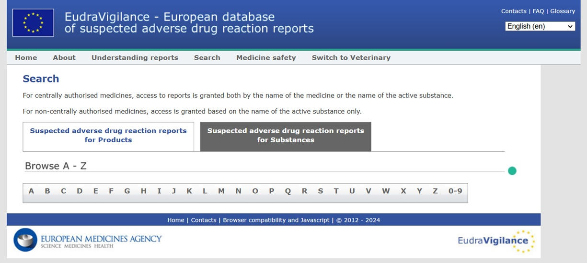
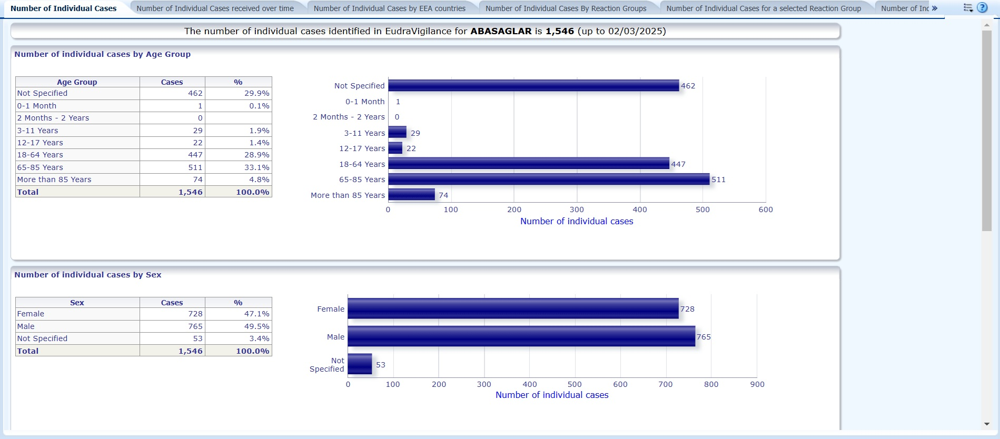
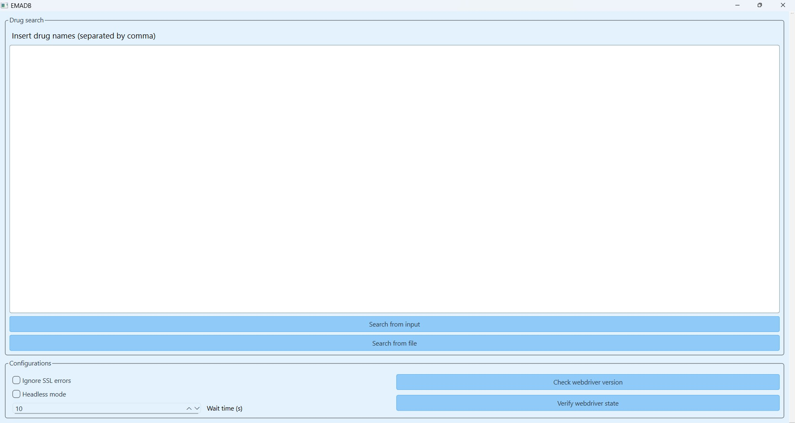

# EMADB AutoPilot

## 1. Project Overview
This project aims to develop a framework that autonomously navigates multiple drug-related online resources to retrieve data regarding drugs interactions and EMA drugs adverse reactions reports. Initially designed to browse the EMA database of EudraVigilance (European Database of suspected adverse drug reaction reports), the project has now been expanded to incorporate additional functionalities.

EudraVigilance is a data processing network and management system for reporting and evaluating suspected adverse drug reactions (ADRs) during the development and following the marketing authorization of medicinal products in the European Economic Area (EEA). The system supports the electronic exchange of suspected adverse drug reaction reports known as Individual Case Safety Reports (ICSRs) between the European Medicines Agency (EMA), National Competent Authorities (NCAs), Marketing Authorization Holders (MAHs), and sponsors of clinical trials in the EEA.

The script automates navigation to https://www.adrreports.eu/en/search.html, where it searches for target drugs specified in *resources/drugs_to_search.txt*. Upon locating the target drugs, the script downloads associated data reports in the form of Excel files. The implementation uses ChromeDriver to simulate user interaction with the browser, ensuring smooth and accurate navigation of the EMA database.

Search page at https://www.adrreports.eu/en/search.html#

The suspected adverse drug reaction report for Abasaglar

## 2. Installation
The installation process on Windows has been designed to be fully automated. To begin, simply run *start_on_windows.bat.* On its first execution, the installation procedure will execute with minimal user input required. The script will check if either Anaconda or Miniconda is installed and can be accessed from your system path. If neither is found, it will automatically download and install the latest Miniconda release from https://docs.anaconda.com/miniconda/. Following this step, the script will proceed with the installation of all necessary Python dependencies. Should you prefer to handle the installation process separately, you can run the standalone installer by running *setup/install_on_windows.bat* or *setup/setup_and_maintenance.bat* and select *Run installation*.  

**Important:** After installation, if the project folder is moved or its path is changed, the application will no longer function correctly. To fix this, you can either:

- Open *setup/setup_and_maintenance.bat* and select *Regenerate relative paths* 
- Manually run the following commands in the terminal, ensuring the project folder is set as the current working directory (CWD):

    `conda activate EMADB`

    `pip install -e . --use-pep517` 

## 3. How to use
On Windows, run *start_on_windows.bat* to launch the application. Please note that some antivirus software, such as Avast, may flag or quarantine python.exe when called by the .bat file. If you encounter unusual behavior, consider adding an exception for your Anaconda or Miniconda environments in your antivirus settings.

**EMAutoPilot:** the main UI allows you to either run a search from file or to use the input text box to insert drug names. Since the script is based on Chromedriver, your need to have Google Chrome browser installed in your system! The correct driver version will be automatically installed, or loaded from the cache if present (default location is home/.wdm).

**Setup and Maintenance:** you can run *setup/setup_and_maintenance.bat* to start the external tools for maintenance. Available options are:
- Run installation: run the application installer for Windows
- Regenerate relative paths: regenerate relative paths if the main folder has been moved or renamed
- Update project: check for updates from Github
- Remove logs: remove all logs file from *resources/logs*

### 3.1 Resources
This folder is used to organize the main data for the project, including downloaded files saved in *resources/download* and the app logs located in *resources/logs*. The *resources/drugs_to_search.txt* file contains the names of the drugs you want to download the reports for.  

### 4. Settings and configurations

| Setting                | Description                                                    |
|------------------------|----------------------------------------------------------------|
| IGNORE_SSL_ERROR       | Ignore SSL error during connection                             |
| HEADLESS               | Use webdriver without GUI                                      |
| WAIT_TIME              | Waiting time before considering action failed                  |

**Environmental variables** are stored in *setup/variables/.env*. For security reasons, this file is typically not uploaded to GitHub. Instead, you must create this file manually by copying the template from *resources/templates/.env* and placing it in the *setup/variables* directory.

| Variable              | Description                                              |
|-----------------------|----------------------------------------------------------|
| None                  | Placeholder for future environmental variables           |

## 5. License
This project is licensed under the terms of the MIT license. See the LICENSE file for details.

